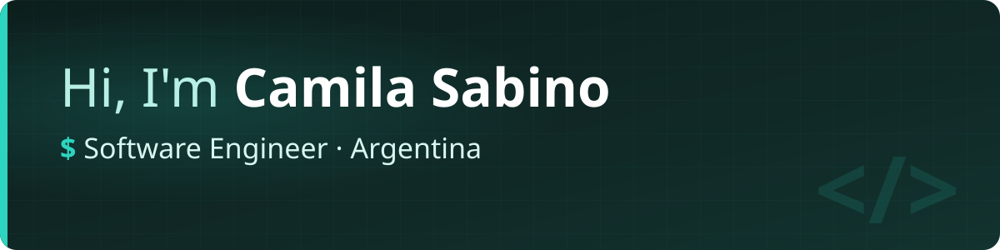

  

  
  
  
  

  

## About me

Software Engineer with 8+ years of experience building and evolving production software. I combine full-stack development with a strong foundation in backend systems, distributed systems, and software architecture, taking end-to-end ownership from design through production operations.

## Stack

**Backend**

**Frontend**

**Data**

**Platform**

## Get in touch

I'm open to Software Engineering opportunities in full-stack development, backend, distributed systems, and software architecture. I'm also interested in projects and collaborations related to AI Engineering.

  
  &nbsp;
  
  &nbsp;
  

